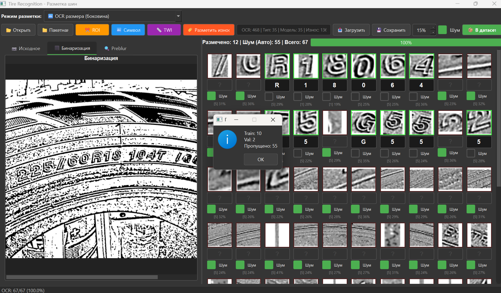
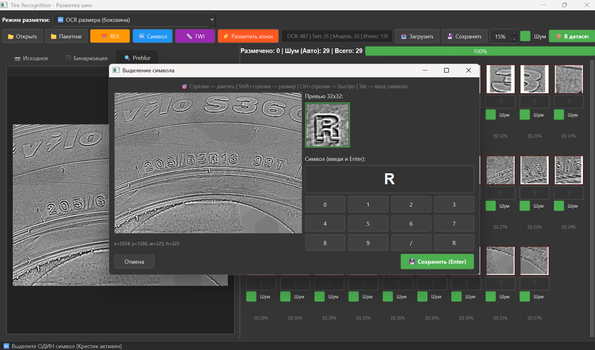
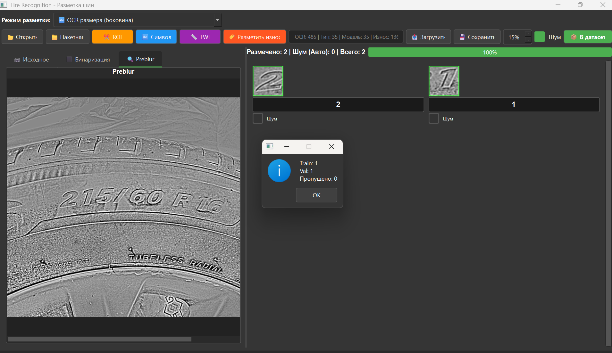
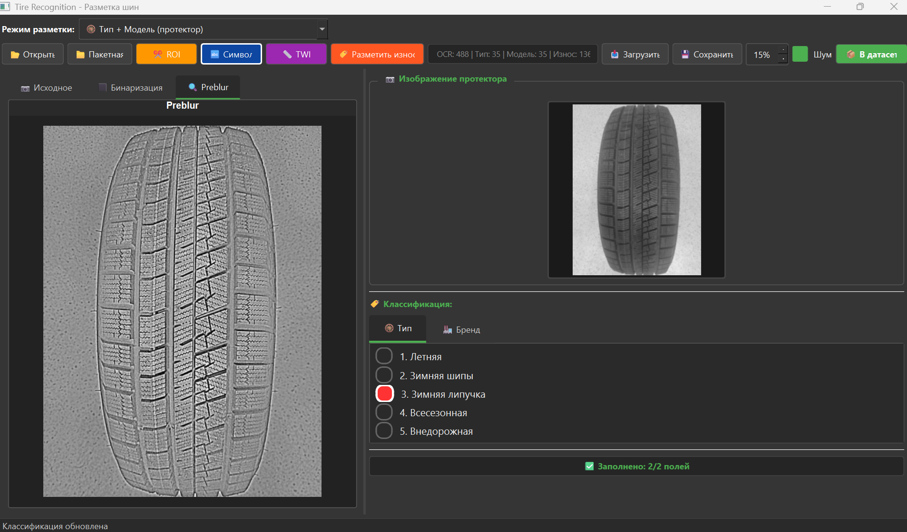
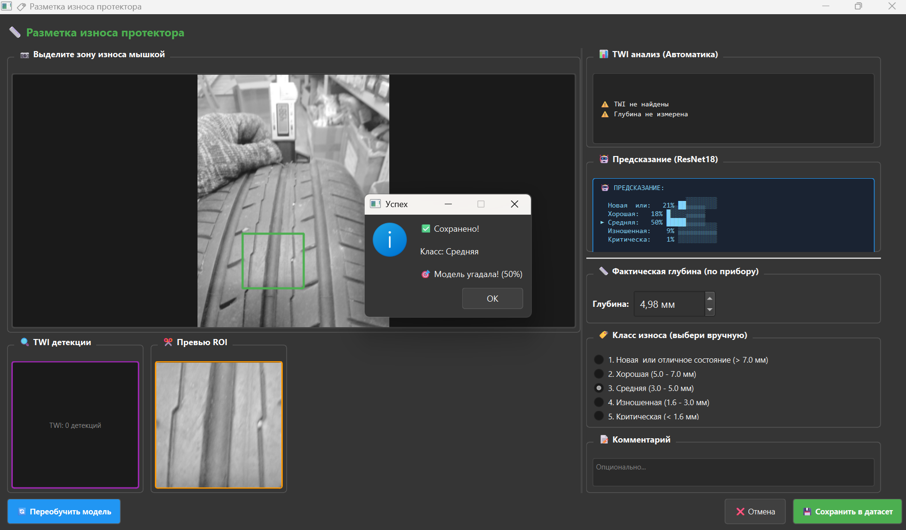
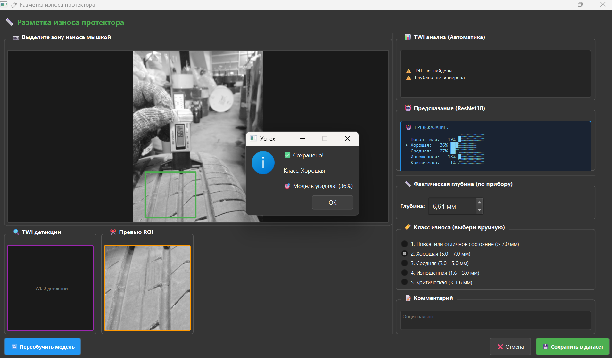
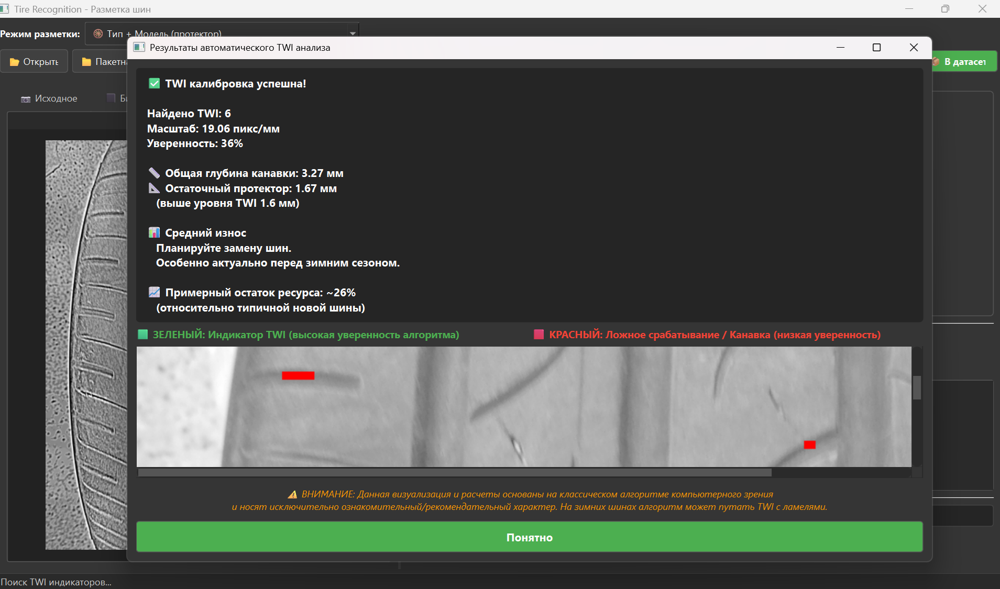

<!-- Open Graph Meta Tags for Social Sharing -->
<meta property="og:type" content="website">
<meta property="og:title" content="Scan Tire AI - Computer Vision for Tire Inspection">
<meta property="og:description" content="Deep Learning architecture for automated tire qualimetry. YOLOX detection, ResNet18 wear classification, ONNX web inference.">
<meta property="og:url" content="https://scantire.com">
<meta property="og:image" content="https://scantire.com/og-image.jpg">
<meta property="og:site_name" content="Scan Tire AI">

<!-- Twitter Card Meta Tags -->
<meta name="twitter:card" content="summary_large_image">
<meta name="twitter:title" content="Scan Tire AI - Automated Tire Inspection">
<meta name="twitter:description" content="AI-powered tire qualimetry using Computer Vision. Open architecture overview.">
<meta name="twitter:image" content="https://scantire.com/og-image.jpg">

<!-- GitHub Specific -->
<meta name="keywords" content="computer vision, tire inspection, deep learning, YOLOX, ResNet, ONNX, automotive AI, tire qualimetry, TWI detection, PyTorch">
<meta name="author" content="Slava Kuzkin">


[](https://scantire.com)
[](#)
[](#)

> **Note:** This repository documents the architecture and research behind **[Scan Tire AI](https://scantire.com)** — an automated tire inspection system using Computer Vision. Source code is not included; this is a technical whitepaper for the CV/ML community.

## 🔬 1. Abstract & Objective

**ScanTire** is an automated hardware-software complex designed for the non-destructive identification and physical qualimetry of pneumatic tires. It solves the problem of automated incoming inspection, cataloging, and condition assessment for auto repair shops, warehouses, and Trade-in e-commerce platforms.

Reading information from a tire is notoriously difficult: it is a **"Black-on-Black" OCR problem**. The text has no color contrast, relies entirely on subtle physical relief, and is heavily corrupted by rubber micro-texture, dirt, and uneven illumination. 

ScanTire solves these physical challenges using a hybrid approach: an aggressive mathematical C++ Computer Vision core for data mining, and a robust ensemble of Deep Convolutional Neural Networks (CNNs) for production inference.

### Core Capabilities:
1. **Curved Surface OCR:** Extraction and recognition of embossed tire sizes (e.g., `205/55 R16`).
2. **Multi-class Classification:** Determining tire seasonality (Summer, Winter Studded, Friction/Velcro, AT) and Brand/Model recognition.
3. **Contactless TWI Qualimetry:** Algorithmic measurement of tread depth using standard Tread Wear Indicators (1.6 mm) as a spatial reference.
4. **AI Wear Grading:** Residual resource classification (5 classes: from "New" to "Critical") using deep residual networks.

---

## 🏛️ 2. System Architecture

The architecture is strictly divided into two independent pipelines: one for **Data Collection (Labeling)** and one for **Production (Web Inference)**.

### 2.1 Data Collection Pipeline (Current Stage)
To build a massive, high-quality proprietary dataset, we developed a custom PyQt6 labeling tool powered by a raw C++ Computer Vision engine.
```text
Raw Image → C++ Mathematical Preprocessing → Slicing into 32x32 Candidates
                                                   ↓
                                    PyQt6 GUI Labeling (Active Learning)
                                                   ↓
                                         dataset/ocr/train/
```

### 2.2 Production Pipeline (Next.js / Web)
In the final product, the mathematical C++ engine is replaced by a cascade of Neural Networks (Object Detection + OCR) to completely eliminate issues with noise and shadows.
```text
Raw Image → YOLOX Detector (Finds the exact BBox of the text) → Crop Region
                                                                    ↓
                                                 Software Slicing of the Crop
                                                                    ↓
                                            ONNX OCR Model (Reads characters)
                                                                    ↓
                                                     Output: "205/55 R16"
```

---

## 🧮 3. The Mathematical Core (C++ Vision Engine)

*Note: In version 5.0, this C++ module is utilized primarily for automated dataset collection (candidate slicing). In the final web application, this role is delegated to the YOLOX detector.*

To isolate text from the rubber background without heavy deep learning, our `cpp/src/` engine implements a multi-stage non-linear spatial filtering pipeline:

1. **Denoise (Non-linear Median Filtering):** Eliminates impulse noise ("salt and pepper" artifacts from dust and sensors) while strictly preserving the sharp edges of embossed characters, which is critical for downstream OCR.
2. **Vignette Correction & Local Division:** Tires are highly convex, resulting in flash glare in the center and deep shadows at the edges. We normalize the background by dividing the original image $I(x,y)$ by a heavily Gaussian-blurred version of itself $I_{blur}(x,y)$:
   $$I_{res}(x,y) = \left( \frac{I(x,y)}{I_{blur}(x,y)} \right) \times C$$
3. **CLAHE (Contrast Limited Adaptive Histogram Equalization):** Adaptively amplifies local contrast by dividing the image into a grid of tiles. The clip limit prevents the over-amplification of noise in homogeneous rubber areas, allowing us to "pull" invisible text out of deep shadows.
4. **Pre-blur Texture Suppression:** A light Gaussian blur ($\sigma=1.0$) designed specifically to mask the micro-texture of the rubber (pores and micro-cracks) so that subsequent gradient operators react only to the macro-edges of the characters.
5. **Sobel Gradient & Relief Extraction:** Since black-on-black text lacks color contrast, we detect physical elevation. We calculate spatial gradients along the X and Y axes using the Sobel operator:
   $$G = \sqrt{G_x^2 + G_y^2}$$
6. **Advanced Adaptive Binarization:** Standard thresholding (like Otsu) fails completely on tires. We utilize the **Wolf** and **NICK** local thresholding algorithms, originally developed for severely degraded historical documents. The threshold $T(x,y)$ is calculated dynamically for each pixel based on local mean and variance.

---

## 🤖 4. Machine Learning Ensemble (PyTorch & YOLOX)

ScanTire relies on an ensemble of specialized models for the production environment:

### 4.1 The ROI Detector (YOLOX - Apache 2.0 License)
*   **Role:** Anchor-free Object Detection. Analyzes the full 4K image and instantly predicts the exact bounding box of the target text (tire size) or brand logos. Highly resistant to dirt and lighting variations.

### 4.2 The OCR Reader (Custom MLP)
*   **Input:** 32x32 px grayscale character segments.
*   **Architecture:** Input(1024) → Hidden(128, ReLU) → Output(40, Softmax).
*   **Role:** A lightweight Multi-Layer Perceptron that classifies individual characters cropped by the detector.

### 4.3 Tire Type & Brand Classifier (MLP/CNN)
*   **Input:** 64x64 px image crops.
*   **Classes:** Summer, Winter Studded, Winter Friction, All-Season, Off-road. Maps the visual tread pattern to specific seasonality and brand hierarchies.

### 4.4 AI Wear Classifier (ResNet18)
*   **Architecture:** Deep Residual Network (Transfer Learning via ImageNet).
*   **Input:** 224x224 px RGB images of the tire tread.
*   **Role:** Analyzes macroscopic tread patterns and microscopic rubber fatigue to classify wear into 5 safety grades (New >7mm down to Critical <1.6mm).

---

## 🛠️ 5. Proprietary Data Collection & Active Learning

To train these models, we developed a custom PyQt6 labeling suite.

### 5.1 Automated OCR Slicing & Noise Filtering
The C++ engine slices the tire sidewall into hundreds of segments. An embedded PyTorch model evaluates each segment. Segments identified as rubber texture are automatically flagged as "Noise" (Active Learning), leaving only true characters for human verification.


*(Fig 1. Automated OCR grid. Background textures are automatically detected and masked as noise by the AI).*

### 5.2 Precision ROI Extraction
For complex, heavily distorted, or connected fonts, the tool allows precise manual extraction and sub-slicing of regions of interest.


*(Fig 2. Manual Symbol extraction tool for edge-case embossed fonts).*


*(Fig 3. Manual ROI extraction tool for edge-case embossed fonts).*

### 5.3 Tire Type & Brand Classification
A dedicated interface for labeling tread seasonality and mapping it to a specific brand.


*(Fig 4. Labeling interface for tread pattern classification).*

### 5.4 Algorithmic TWI Detection & Wear Annotation
The system automatically locates Tread Wear Indicators (TWI), calculates the spatial scale (pixels per mm), and estimates the remaining tread depth.


*(Fig 5. AI predicting "Medium Condition" matched with actual caliper measurements).*


*(Fig 6. AI predicting "Good Condition" (plenty of tread life remaining) matched with actual caliper measurements).*


*(Fig 7. Automated Computer Vision TWI detection. Green indicates high-confidence indicators, Red flags potential false positives).*

---

## 🚀 6. Export and Next.js Integration (Web Inference)

The ScanTire AI engine is optimized for Edge/Web inference using **ONNX Runtime (WebAssembly)** and Node.js.

### Example: Cascaded Inference in Next.js (TypeScript)

```typescript
import * as ort from 'onnxruntime-web';

// 1. Initialize sessions
const detectorSession = await ort.InferenceSession.create('/models/yolox_detector.onnx');
const ocrSession = await ort.InferenceSession.create('/models/model_ocr.onnx');

async function processTireImage(imageBuffer: Float32Array, width: number, height: number) {
  // STAGE 1: Find the text region (YOLOX)
  const detTensor = new ort.Tensor('float32', imageBuffer, [1, 3, height, width]);
  const detResults = await detectorSession.run({ input: detTensor });
  const bbox = extractBestBoundingBox(detResults.output.data);
  
  // STAGE 2: Crop and slice
  const characterCrops = cropAndSplitIntoCharacters(imageBuffer, bbox);
  
  // STAGE 3: Character Recognition (Custom OCR)
  let resultText = "";
  for (const cropBuffer of characterCrops) {
     const ocrTensor = new ort.Tensor('float32', cropBuffer, [1, 1, 32, 32]);
     const ocrResults = await ocrSession.run({ input: ocrTensor });
     
     const char = getHighestProbabilityClass(ocrResults.output.data);
     if (char !== "Noise") resultText += char;
  }
  
  return resultText; // Output: "205/55R16"
}
```

---

## 🤝 Partnership & API Access

Working on Automotive Tech, Trade-in platforms, or Warehouse automation?

We're looking for early partners to integrate Scan Tire AI into real-world products.

👉 **[Visit scantire.com](https://scantire.com) — request API access or contact us for collaboration.**

---
*© 2026 Scan Tire AI. All rights reserved. Architecture, codebase, and datasets are proprietary.*
